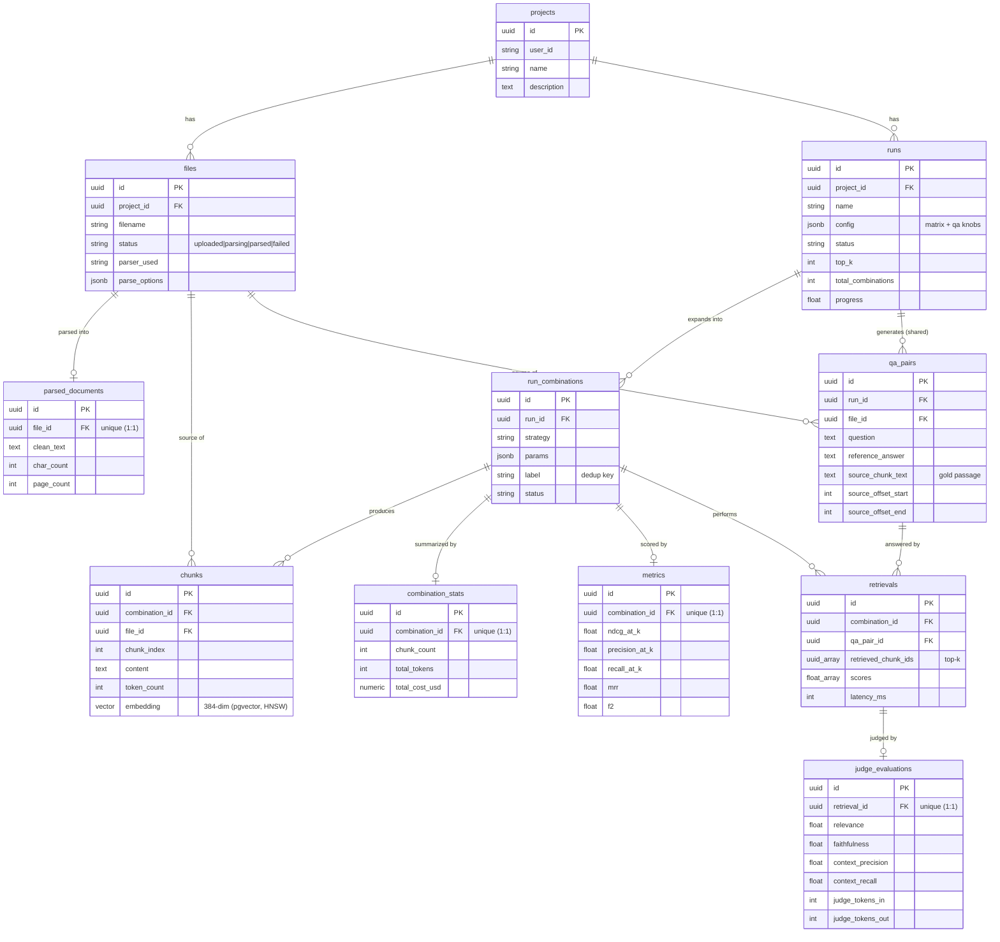

# chunklab — Data Model

This document describes the chunklab database: the two-schema design, every
table with its columns / types / keys / foreign keys (including cross-schema
foreign keys), the pgvector embedding column, the HNSW cosine index, and how the
database is bootstrapped idempotently at startup.

It is grounded in the actual SQLAlchemy 2 models:

- `backend/app/db/base.py` — single shared `MetaData` (schema set per-table) + `TimestampMixin`
- `backend/app/db/models_core.py` — `core` schema
- `backend/app/db/models_results.py` — `results` schema
- `backend/app/db/setup_db.py` — `init_db()` bootstrap

---

## Entity-relationship diagram

The eleven tables and how they reference each other. `core` tables (indigo in the
[visual version](./er_diagram.html)) hold what you create; `results` tables hold
what a run produces. All foreign keys are `ON DELETE CASCADE`; cross-schema FKs
(e.g. `results.chunks.combination_id → core.run_combinations.id`) are real
constraints. `||--o{` = one-to-many, `||--o|` = one-to-(zero-or)-one (a unique FK).



> A standalone visual version (color-coded by schema) lives at
> [`docs/er_diagram.html`](./er_diagram.html); a populated example (one run traced
> through every table with sample rows) is at
> [`docs/sample_run_data.html`](./sample_run_data.html).

---

## 1. Two-schema design: `core` vs `results`

chunklab splits its tables across **two Postgres schemas** in the same database:

| Schema | Purpose | Tables |
|--------|---------|--------|
| `core` | Application data — the things a user creates and manages | `projects`, `files`, `parsed_documents`, `runs`, `run_combinations` |
| `results` | Experiment output — everything a pipeline run produces | `chunks` (with embeddings), `combination_stats`, `qa_pairs`, `retrievals`, `judge_evaluations`, `metrics` |

The split is implemented with a **single shared `MetaData`**; each table declares
its schema individually via `__table_args__` (`backend/app/db/base.py`):

```python
class Base(DeclarativeBase):
    metadata = MetaData()          # ONE MetaData for both schemas

# Aliases used by the models — both point at the same Base.
CoreBase = Base
ResultsBase = Base
```

```python
# e.g. in models_core.py
class Project(CoreBase, TimestampMixin):
    __tablename__ = "projects"
    __table_args__ = {"schema": "core"}
    ...

# e.g. in models_results.py
class Chunk(ResultsBase, TimestampMixin):
    __tablename__ = "chunks"
    __table_args__ = {"schema": "results"}
    ...
```

A **single** `MetaData` (rather than one per schema) is required so that
**cross-schema foreign keys** — e.g. `results.chunks.file_id → core.files.id` —
resolve during `create_all()`. With two separate `MetaData` registries, the FK
target lives in a different registry and `create_all` raises
`NoReferencedTableError`. The `CoreBase` / `ResultsBase` names are kept only as
readability aliases; they are literally the same class. SQLAlchemy still emits
every table qualified with its schema (`core.projects`, `results.chunks`, ...).

### Why two schemas

- **Separation of concerns.** Application/control-plane data (projects, files,
  runs) lives apart from experiment output (chunks, vectors, scores, metrics).
  This is an explicit project requirement, documented in `base.py`.
- **Run results are append-heavy and disposable.** Everything in `results` is
  derived from a run and can be regenerated by re-running the pipeline. Keeping
  it in its own schema makes it easy to reason about, query, back up, or purge
  independently of the canonical application data in `core`.
- **The big, vector-heavy table is isolated.** `results.chunks` holds one
  384-dim `vector` per chunk plus the HNSW index. Quarantining it (and the rest
  of the experiment tables) in `results` keeps `core` small and cheap.
- **Cross-schema foreign keys are fully supported by Postgres**, so the
  separation costs nothing in referential integrity: `results` rows still point
  directly at `core` rows (and at each other) with real FK constraints and
  `ON DELETE CASCADE`.

### Shared conventions

- **Primary keys**: every table uses a `UUID` PK
  (`uuid.uuid4` default, `as_uuid=True`), via the local `_pk()` helper.
- **Timestamps**: most tables mix in `TimestampMixin`, which adds
  `created_at TIMESTAMP` with a `server_default=now()`. (`ParsedDocument` is the
  one model that does **not** use the mixin; it tracks `parsed_at` instead.)
- **Cascades**: foreign keys use `ON DELETE CASCADE` at the database level;
  ORM relationships use `cascade="all, delete-orphan"`. Deleting a project tears
  down its files, parsed docs, runs, combinations — and, via cross-schema FKs,
  the chunks / stats / qa / retrievals / judgments / metrics in `results`.

---

## 2. `core` schema

### 2.1 `core.projects`

The top-level container. Holds files and runs.

| Column | Type | Constraints / Notes |
|--------|------|---------------------|
| `id` | `UUID` | **PK**, default `uuid4` |
| `user_id` | `VARCHAR(128)` | `NOT NULL`, default `"anonymous"`, **indexed** |
| `name` | `VARCHAR(256)` | `NOT NULL` |
| `description` | `TEXT` | nullable |
| `created_at` | `TIMESTAMP` | `server_default=now()` (from `TimestampMixin`) |
| `updated_at` | `TIMESTAMP` | `server_default=now()`, `onupdate=now()` |

**Foreign keys:** none.
**Relationships:** `files` (1→N), `runs` (1→N), both `cascade="all, delete-orphan"`.

### 2.2 `core.files`

An uploaded source document. Tracks parse status.

| Column | Type | Constraints / Notes |
|--------|------|---------------------|
| `id` | `UUID` | **PK**, default `uuid4` |
| `project_id` | `UUID` | **FK → `core.projects.id`** `ON DELETE CASCADE`, **indexed** |
| `filename` | `VARCHAR(512)` | `NOT NULL` |
| `storage_path` | `TEXT` | `NOT NULL` (path on disk under `STORAGE_DIR`) |
| `mime_type` | `VARCHAR(128)` | nullable |
| `size_bytes` | `BIGINT` | nullable |
| `status` | `VARCHAR(32)` | `NOT NULL`, default `"uploaded"`, **indexed** — one of `uploaded \| parsing \| parsed \| failed` |
| `parser_used` | `VARCHAR(32)` | nullable (e.g. `docling`, `pypdf`, `text`) |
| `error` | `TEXT` | nullable (parse error message) |
| `created_at` | `TIMESTAMP` | `server_default=now()` |

**Foreign keys:** `project_id → core.projects.id` (CASCADE).
**Relationships:** `project` (N→1); `parsed` (1→1, `uselist=False`, cascade delete).

### 2.3 `core.parsed_documents`

The clean, extracted text for a file. One per file (1:1).

| Column | Type | Constraints / Notes |
|--------|------|---------------------|
| `id` | `UUID` | **PK**, default `uuid4` |
| `file_id` | `UUID` | **FK → `core.files.id`** `ON DELETE CASCADE`, **`UNIQUE`**, **indexed** |
| `clean_text` | `TEXT` | `NOT NULL` — extracted document text |
| `char_count` | `INTEGER` | `NOT NULL`, default `0` |
| `page_count` | `INTEGER` | nullable |
| `parsed_at` | `TIMESTAMP` | `server_default=now()` |

**Foreign keys:** `file_id → core.files.id` (CASCADE), `UNIQUE` (enforces 1:1).
**Relationships:** `file` (1→1).
**Note:** does not use `TimestampMixin` (no `created_at`); uses `parsed_at`.

### 2.4 `core.runs`

A single experiment run over a project: a config plus a set of combinations.

| Column | Type | Constraints / Notes |
|--------|------|---------------------|
| `id` | `UUID` | **PK**, default `uuid4` |
| `project_id` | `UUID` | **FK → `core.projects.id`** `ON DELETE CASCADE`, **indexed** |
| `name` | `VARCHAR(256)` | `NOT NULL` |
| `config` | `JSONB` | `NOT NULL`, default `{}` — full run spec (combinations, file selection, etc.) |
| `embedding_model` | `VARCHAR(128)` | `NOT NULL` (e.g. `BAAI/bge-small-en-v1.5`) |
| `top_k` | `INTEGER` | `NOT NULL`, default `5` |
| `status` | `VARCHAR(32)` | `NOT NULL`, default `"queued"`, **indexed** — one of `queued \| running \| completed \| failed \| partial \| canceled` |
| `progress` | `FLOAT` | default `0.0` (0..1, denormalized by the worker) |
| `total_combinations` | `INTEGER` | `NOT NULL`, default `0` |
| `started_at` | `TIMESTAMP` | nullable |
| `completed_at` | `TIMESTAMP` | nullable |
| `error` | `TEXT` | nullable |
| `created_at` | `TIMESTAMP` | `server_default=now()` |

**Foreign keys:** `project_id → core.projects.id` (CASCADE).
**Relationships:** `project` (N→1); `combinations` (1→N, cascade delete).

### 2.5 `core.run_combinations`

One chunking-strategy cell within a run (the expanded `{strategy, params}`
spec). This is the **central join point**: most `results`-schema tables FK into
it cross-schema.

| Column | Type | Constraints / Notes |
|--------|------|---------------------|
| `id` | `UUID` | **PK**, default `uuid4` |
| `run_id` | `UUID` | **FK → `core.runs.id`** `ON DELETE CASCADE`, **indexed** |
| `strategy` | `VARCHAR(32)` | `NOT NULL` — `sentence \| character \| recursive \| token \| semantic` |
| `params` | `JSONB` | `NOT NULL`, default `{}` — strategy params (size, overlap, breakpoint_percentile, ...) |
| `label` | `VARCHAR(128)` | `NOT NULL` — human label, e.g. `sentence·512/64`, `semantic·pct95` |
| `status` | `VARCHAR(32)` | `NOT NULL`, default `"queued"`, **indexed** — one of `queued \| chunking \| embedding \| evaluating \| completed \| failed` |
| `progress` | `FLOAT` | default `0.0` (0..1, denormalized by the worker) |
| `created_at` | `TIMESTAMP` | `server_default=now()` |

**Foreign keys:** `run_id → core.runs.id` (CASCADE).
**Relationships:** `run` (N→1).

---

## 3. `results` schema

All `results` tables carry a `created_at` from `TimestampMixin`. Several FK
**across schemas** into `core` (notably into `core.run_combinations`,
`core.runs`, `core.files`), and some FK **within** `results`.

### 3.1 `results.chunks` (vector table)

One produced chunk, with its embedding. This is the searchable vector table.

| Column | Type | Constraints / Notes |
|--------|------|---------------------|
| `id` | `UUID` | **PK**, default `uuid4` |
| `combination_id` | `UUID` | **FK → `core.run_combinations.id`** (cross-schema) `ON DELETE CASCADE`, **indexed** |
| `file_id` | `UUID` | **FK → `core.files.id`** (cross-schema) `ON DELETE CASCADE`, **indexed** |
| `chunk_index` | `INTEGER` | `NOT NULL` — order of the chunk within the file |
| `content` | `TEXT` | `NOT NULL` — the chunk text |
| `token_count` | `INTEGER` | `NOT NULL`, default `0` |
| `char_count` | `INTEGER` | `NOT NULL`, default `0` |
| `embedding` | **`vector(384)`** | `NOT NULL` — pgvector column, see §4 |
| `created_at` | `TIMESTAMP` | `server_default=now()` |

**Foreign keys (both cross-schema):**
- `combination_id → core.run_combinations.id` (CASCADE)
- `file_id → core.files.id` (CASCADE)

**Indexes:**
- B-tree on `combination_id`, on `file_id`
- **HNSW** on `embedding` using `vector_cosine_ops` — see §4.

### 3.2 `results.combination_stats`

Aggregate cost / size / latency stats for one combination. One per combination.

| Column | Type | Constraints / Notes |
|--------|------|---------------------|
| `id` | `UUID` | **PK**, default `uuid4` |
| `combination_id` | `UUID` | **FK → `core.run_combinations.id`** (cross-schema) `ON DELETE CASCADE`, **`UNIQUE`**, **indexed** |
| `chunk_count` | `INTEGER` | default `0` |
| `total_tokens` | `INTEGER` | default `0` |
| `avg_tokens_per_chunk` | `FLOAT` | default `0.0` |
| `embedding_cost_usd` | `NUMERIC(12,6)` | default `0` (notional embedding cost) |
| `judge_cost_usd` | `NUMERIC(12,6)` | default `0` (real Groq judge cost) |
| `total_cost_usd` | `NUMERIC(12,6)` | default `0` (embedding + judge) |
| `chunk_latency_ms` | `INTEGER` | default `0` |
| `embed_latency_ms` | `INTEGER` | default `0` |
| `eval_latency_ms` | `INTEGER` | default `0` |
| `created_at` | `TIMESTAMP` | `server_default=now()` |

**Foreign keys:** `combination_id → core.run_combinations.id` (cross-schema, CASCADE), `UNIQUE` (1:1 per combination).

### 3.3 `results.qa_pairs`

The shared QA evaluation set generated once per run. Scoped to a run + the file
the question was drawn from.

| Column | Type | Constraints / Notes |
|--------|------|---------------------|
| `id` | `UUID` | **PK**, default `uuid4` |
| `run_id` | `UUID` | **FK → `core.runs.id`** (cross-schema) `ON DELETE CASCADE`, **indexed** |
| `file_id` | `UUID` | **FK → `core.files.id`** (cross-schema) `ON DELETE CASCADE`, **indexed** |
| `question` | `TEXT` | `NOT NULL` |
| `reference_answer` | `TEXT` | `NOT NULL` |
| `source_chunk_text` | `TEXT` | `NOT NULL` — the gold passage |
| `source_offset_start` | `INTEGER` | default `0` — gold char offset start |
| `source_offset_end` | `INTEGER` | default `0` — gold char offset end |
| `created_at` | `TIMESTAMP` | `server_default=now()` |

**Foreign keys (both cross-schema):**
- `run_id → core.runs.id` (CASCADE)
- `file_id → core.files.id` (CASCADE)

### 3.4 `results.retrievals`

One top-k retrieval result for a (combination, qa_pair) pair.

| Column | Type | Constraints / Notes |
|--------|------|---------------------|
| `id` | `UUID` | **PK**, default `uuid4` |
| `combination_id` | `UUID` | **FK → `core.run_combinations.id`** (cross-schema) `ON DELETE CASCADE`, **indexed** |
| `qa_pair_id` | `UUID` | **FK → `results.qa_pairs.id`** (same schema) `ON DELETE CASCADE`, **indexed** |
| `retrieved_chunk_ids` | `UUID[]` | `ARRAY(UUID)`, default `[]` — ordered top-k chunk IDs |
| `scores` | `FLOAT[]` | `ARRAY(FLOAT)`, default `[]` — relevance per retrieved chunk (`1 - cosine_distance`) |
| `latency_ms` | `INTEGER` | default `0` |
| `created_at` | `TIMESTAMP` | `server_default=now()` |

**Foreign keys:**
- `combination_id → core.run_combinations.id` (cross-schema, CASCADE)
- `qa_pair_id → results.qa_pairs.id` (same-schema, CASCADE)

**Note:** `retrieved_chunk_ids` is a denormalized UUID array (not an FK
constraint) referencing `results.chunks.id`, parallel-ordered with `scores`.

### 3.5 `results.judge_evaluations`

The LLM-judge scoring of one retrieval. One per retrieval.

| Column | Type | Constraints / Notes |
|--------|------|---------------------|
| `id` | `UUID` | **PK**, default `uuid4` |
| `retrieval_id` | `UUID` | **FK → `results.retrievals.id`** (same schema) `ON DELETE CASCADE`, **`UNIQUE`**, **indexed** |
| `relevance` | `FLOAT` | default `0.0` (0..1) |
| `faithfulness` | `FLOAT` | default `0.0` (0..1) |
| `context_precision` | `FLOAT` | default `0.0` (0..1) |
| `context_recall` | `FLOAT` | default `0.0` (0..1) |
| `judge_feedback` | `TEXT` | nullable |
| `judge_model` | `VARCHAR(128)` | nullable (e.g. `llama-3.3-70b-versatile`) |
| `judge_tokens_in` | `INTEGER` | default `0` |
| `judge_tokens_out` | `INTEGER` | default `0` |
| `created_at` | `TIMESTAMP` | `server_default=now()` |

**Foreign keys:** `retrieval_id → results.retrievals.id` (same-schema, CASCADE), `UNIQUE` (1:1 per retrieval).

### 3.6 `results.metrics`

Aggregate evaluation scorecard for one combination: LLM-judged means plus
computed IR macro-averages. One per combination.

| Column | Type | Constraints / Notes |
|--------|------|---------------------|
| `id` | `UUID` | **PK**, default `uuid4` |
| `combination_id` | `UUID` | **FK → `core.run_combinations.id`** (cross-schema) `ON DELETE CASCADE`, **`UNIQUE`**, **indexed** |
| `relevance` | `FLOAT` | default `0.0` — judged mean |
| `faithfulness` | `FLOAT` | default `0.0` — judged mean |
| `context_precision` | `FLOAT` | default `0.0` — judged mean |
| `context_recall` | `FLOAT` | default `0.0` — judged mean |
| `precision_at_k` | `FLOAT` | default `0.0` — computed macro-avg |
| `recall_at_k` | `FLOAT` | default `0.0` — computed macro-avg |
| `mrr` | `FLOAT` | default `0.0` — computed macro-avg |
| `ndcg_at_k` | `FLOAT` | default `0.0` — computed macro-avg |
| `f2` | `FLOAT` | default `0.0` — computed macro-avg |
| `avg_retrieval_latency_ms` | `FLOAT` | default `0.0` |
| `created_at` | `TIMESTAMP` | `server_default=now()` |

**Foreign keys:** `combination_id → core.run_combinations.id` (cross-schema, CASCADE), `UNIQUE` (1:1 per combination).

---

## 4. The pgvector embedding column and HNSW index

### 4.1 `vector(384)` column

`results.chunks.embedding` is a pgvector column, declared via the SQLAlchemy
type from `pgvector.sqlalchemy`:

```python
from pgvector.sqlalchemy import Vector
embedding: Mapped[list[float]] = mapped_column(Vector(EMBEDDING_DIM))
```

- `EMBEDDING_DIM` comes from settings (`get_settings().EMBEDDING_DIM`), which is
  **384** — matching the embedding model `BAAI/bge-small-en-v1.5`.
- Postgres column type is `vector(384)`. Every chunk stores exactly one 384-dim
  vector.
- The column is `NOT NULL` — chunks are always inserted with their embeddings
  already computed by the worker.

### 4.2 HNSW cosine index

Vector search uses an **HNSW** (Hierarchical Navigable Small World) index over
the cosine-distance operator class, created in `init_db()`:

```sql
CREATE INDEX IF NOT EXISTS idx_chunks_embedding_hnsw
ON results.chunks USING hnsw (embedding vector_cosine_ops)
WITH (m = 16, ef_construction = 64);
```

- **Operator class `vector_cosine_ops`** → cosine distance, matching the
  retriever which orders by `embedding.cosine_distance(query_vector)` and
  reports `relevance = 1 - distance`.
- **`m = 16`** — max edges per node per layer.
- **`ef_construction = 64`** — candidate-list size during index build.
- **HNSW over IVFFlat:** HNSW needs no training pass and supports inserts as
  chunks are written, which suits the run pipeline's bulk-insert pattern.

The index is created by `init_db()`, not by `create_all` (SQLAlchemy does not
model HNSW indexes), so it lives in the same idempotent bootstrap (§5).

---

## 5. Idempotent bootstrap — `init_db()` (no Alembic in v0.1)

There is **no Alembic / migration tooling in v0.1**. Instead, the schema is
created by an idempotent bootstrap, `init_db()` in
`backend/app/db/setup_db.py`, invoked at app/worker startup (the FastAPI
`lifespan` calls it). It is safe to call repeatedly.

In one transaction (`engine.begin()`), it:

1. `CREATE EXTENSION IF NOT EXISTS vector` — enable pgvector.
2. `CREATE SCHEMA IF NOT EXISTS core`
3. `CREATE SCHEMA IF NOT EXISTS results`
4. `CoreBase.metadata.create_all` — create all `core` tables **first**
   (so the cross-schema FKs from `results` into `core` have targets).
5. `ResultsBase.metadata.create_all` — create all `results` tables.
6. `CREATE INDEX IF NOT EXISTS idx_chunks_embedding_hnsw ...` — the HNSW index.

Every statement uses `IF NOT EXISTS` (or SQLAlchemy's checkfirst
`create_all`), so re-running on an already-initialized database is a no-op.
Schema-creation **order matters**: `core` is created before `results` because
`results` tables carry cross-schema foreign keys into `core`.

> In Docker, the Postgres container also runs `infra/init.sql` on first boot
> (`CREATE EXTENSION vector` + the two schemas). `init_db()` re-applies the same
> objects idempotently at application startup, so the database is correct whether
> or not that init script ran.

---

## 6. ASCII ER diagram

Cross-schema foreign keys are marked `==>`. Same-schema foreign keys are `-->`.

```
                         SCHEMA: core
  +------------------------------------------------------------+
  |                                                            |
  |   projects                                                 |
  |   --------                                                 |
  |   id (PK)                                                  |
  |   user_id, name, description                               |
  |   created_at, updated_at                                   |
  |     |                  |                                   |
  |     | 1:N              | 1:N                               |
  |     v                  v                                   |
  |   files              runs                                  |
  |   -----              ----                                  |
  |   id (PK)            id (PK)                               |
  |   project_id (FK) -->/  project_id (FK) --> projects.id    |
  |   filename           name, config, embedding_model         |
  |   storage_path       top_k, status, progress              |
  |   status, parser     total_combinations                    |
  |     |                started_at, completed_at, error       |
  |     | 1:1              |                                   |
  |     v                  | 1:N                               |
  |   parsed_documents     v                                   |
  |   ----------------    run_combinations                     |
  |   id (PK)             ----------------                     |
  |   file_id (FK,UNIQUE) id (PK)                              |
  |     --> files.id      run_id (FK) --> runs.id              |
  |   clean_text          strategy, params, label             |
  |   char_count          status, progress                    |
  |   page_count            ^   ^   ^                          |
  |   parsed_at             |   |   |                          |
  +-------------------------|---|---|--------------------------+
            ^   ^           |   |   |
   file_id  |   | file_id   | combination_id (cross-schema)    
   (cross)  |   | (cross)   |   |   |
  +---------|---|-----------|---|---|--------------------------+
  |         |   |           |   |   |     SCHEMA: results      |
  |         |   |           |   |   |                          |
  |   chunks==+ |        ===+   |   +=== metrics               |
  |   ------    |        |      |        -------               |
  |   id (PK)   |        |      |        id (PK)               |
  |   combination_id (FK)==> core.run_combinations.id          |
  |   file_id (FK) ==> core.files.id                           |
  |   chunk_index, content                                     |
  |   token_count, char_count                                  |
  |   embedding  vector(384)  [HNSW vector_cosine_ops]         |
  |                                                            |
  |   combination_stats   metrics                              |
  |   ----------------    -------                              |
  |   id (PK)             id (PK)                              |
  |   combination_id      combination_id                       |
  |     (FK,UNIQUE) ==>     (FK,UNIQUE) ==>                    |
  |     core.run_combinations.id   core.run_combinations.id    |
  |   chunk_count        relevance, faithfulness               |
  |   total_tokens       context_precision/recall              |
  |   *_cost_usd         precision@k, recall@k                 |
  |   *_latency_ms       mrr, ndcg@k, f2, latency              |
  |                                                            |
  |   qa_pairs                                                 |
  |   --------                                                 |
  |   id (PK)                                                  |
  |   run_id  (FK) ==> core.runs.id                            |
  |   file_id (FK) ==> core.files.id                           |
  |   question, reference_answer                               |
  |   source_chunk_text, source_offset_start/end              |
  |     |                                                      |
  |     | 1:N (qa_pair_id)                                     |
  |     v                                                      |
  |   retrievals                                               |
  |   ----------                                               |
  |   id (PK)                                                  |
  |   combination_id (FK) ==> core.run_combinations.id         |
  |   qa_pair_id (FK) --> results.qa_pairs.id                  |
  |   retrieved_chunk_ids UUID[]  (-> chunks.id, denormalized) |
  |   scores FLOAT[], latency_ms                               |
  |     |                                                      |
  |     | 1:1 (retrieval_id)                                   |
  |     v                                                      |
  |   judge_evaluations                                        |
  |   -----------------                                        |
  |   id (PK)                                                  |
  |   retrieval_id (FK,UNIQUE) --> results.retrievals.id       |
  |   relevance, faithfulness                                  |
  |   context_precision/recall                                 |
  |   judge_feedback, judge_model                              |
  |   judge_tokens_in/out                                      |
  +------------------------------------------------------------+

  Legend:
    -->   foreign key within the same schema
    ==>   foreign key across schemas (results -> core)
    All FKs are ON DELETE CASCADE.
    UNIQUE on an FK enforces a 1:1 relationship.
```

### Foreign-key summary

| From (table.column) | To (table.column) | Cross-schema? | Cardinality |
|---------------------|-------------------|---------------|-------------|
| `core.files.project_id` | `core.projects.id` | no | N:1 |
| `core.parsed_documents.file_id` | `core.files.id` | no | 1:1 (UNIQUE) |
| `core.runs.project_id` | `core.projects.id` | no | N:1 |
| `core.run_combinations.run_id` | `core.runs.id` | no | N:1 |
| `results.chunks.combination_id` | `core.run_combinations.id` | **yes** | N:1 |
| `results.chunks.file_id` | `core.files.id` | **yes** | N:1 |
| `results.combination_stats.combination_id` | `core.run_combinations.id` | **yes** | 1:1 (UNIQUE) |
| `results.qa_pairs.run_id` | `core.runs.id` | **yes** | N:1 |
| `results.qa_pairs.file_id` | `core.files.id` | **yes** | N:1 |
| `results.retrievals.combination_id` | `core.run_combinations.id` | **yes** | N:1 |
| `results.retrievals.qa_pair_id` | `results.qa_pairs.id` | no | N:1 |
| `results.judge_evaluations.retrieval_id` | `results.retrievals.id` | no | 1:1 (UNIQUE) |
| `results.metrics.combination_id` | `core.run_combinations.id` | **yes** | 1:1 (UNIQUE) |

> `results.retrievals.retrieved_chunk_ids` is a `UUID[]` array that references
> `results.chunks.id` positionally (parallel to `scores`); it is **denormalized**
> and is not a declared foreign-key constraint.
